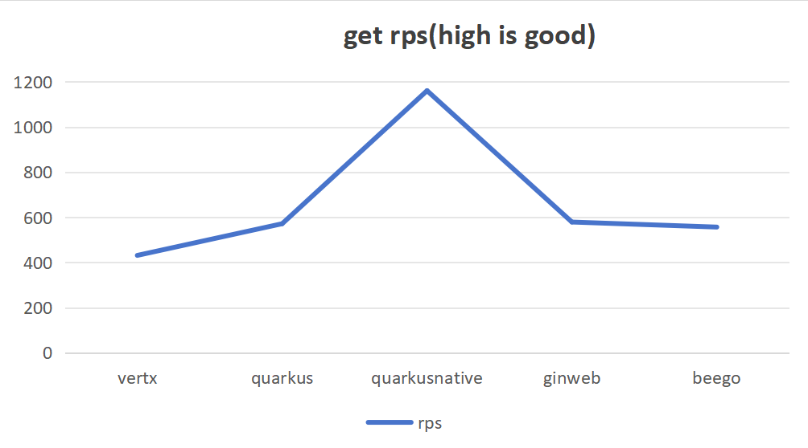
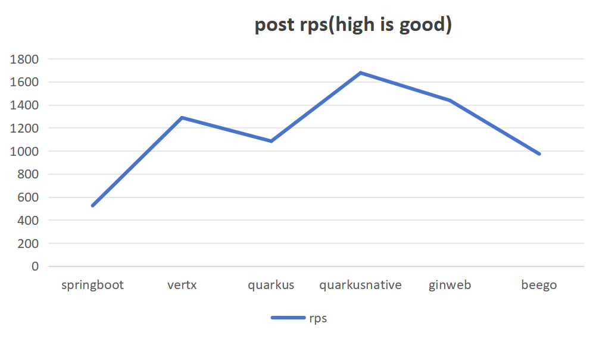
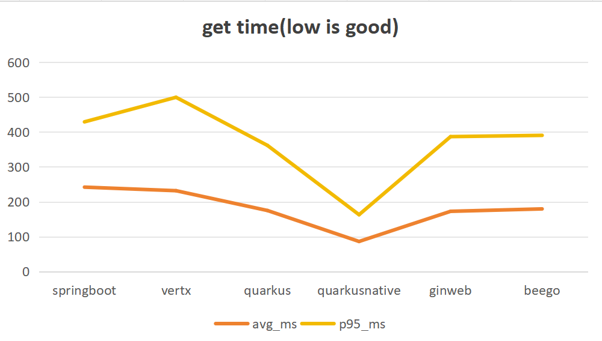
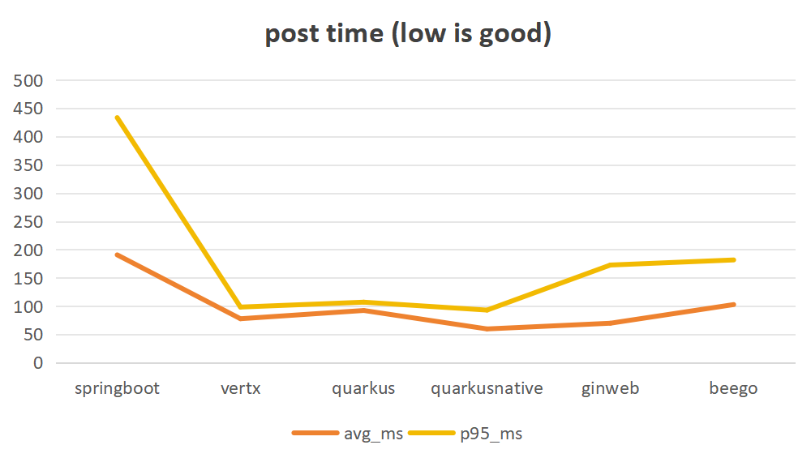
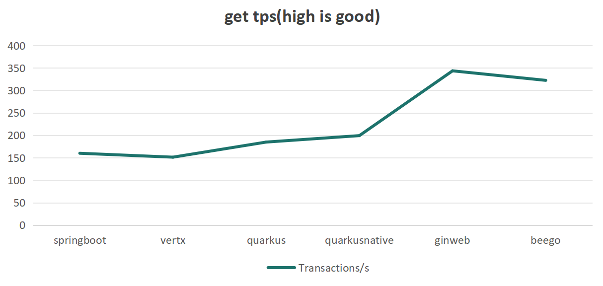
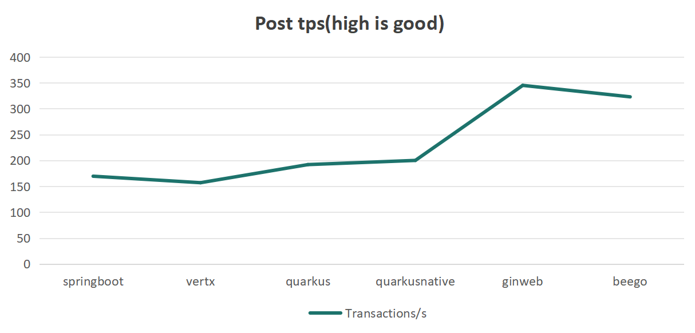
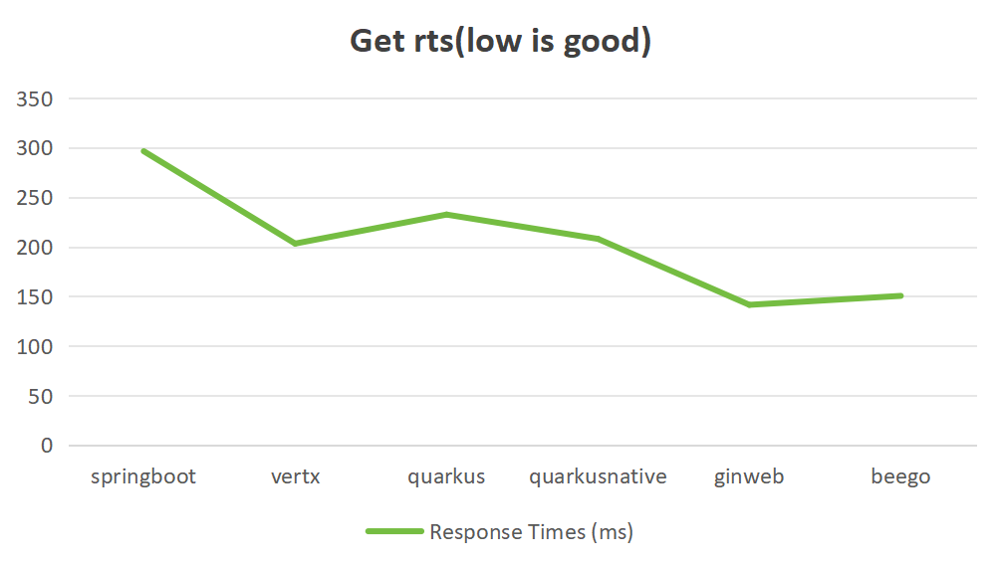
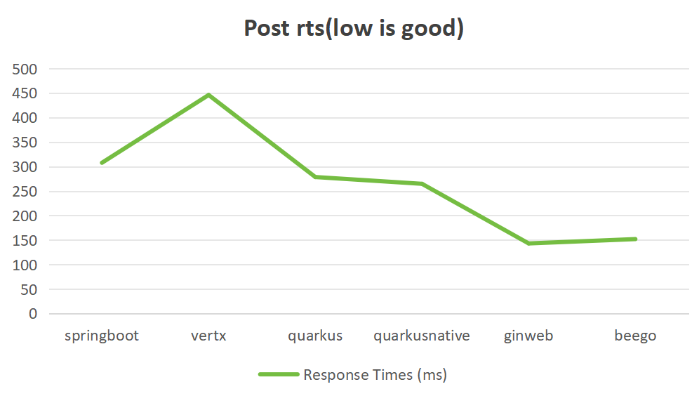

# performance comparing  benchmarks

## preface

通过构建下单业务场景去验证语言和框架之间的性能差异。check目前互联网上的性能对比文章，验证结果是否符合预期。

## code structure

springbootdemo--spring boot project 

verxdemo-- vert.x project 

quarkdemo -- quarkus project  

gindemo-- go gin project 

beegodemo go beego project 

## 框架

| 语言 | 版本号                  | 框架       | 版本     | 备注         |
|:--- |:---------------------- |:--------- |:------- |:----------- |
| Java | eclipse-temurin:21.0.9_10 | Spring boot | 3.5.5    |              |
|      |                         | Vert.x     | 5.0.4    |              |
|      |                         | Quarkus    | 3.29.4   |              |
| Go   | 1.24.11                 | Gin        | 1.11.0   |              |
|      |                         | beego      | 2.3.8    |              |

## 业务场景

为避免网络和组件的影响，数据库统一采用sqlite,存放当前用户家目录下 

场景:

1、读场景：商品浏览–获取商品的详情页面。通过http get请求，传入商品ID，从db中读取信息，回传页面

2、写场景：生成订单-获取商品详情，下单生成订单。通过http post请求, 传入购买者ID，商品ID，数量，向db中写数据，不减库存，不加锁 

## 实现

约定:

1、全部使用Docker Containers验证。docker实例限制资源（0.5u 500m）

2、根据目标语言和框架生成5个工程项目，每个工程项目单独对应独立的数据库

3、基准工具使用Jmeter &  Apache AB

## how to run

docker-compose --compatibility up -d

## result

### Apache Benchmark

### Jmeter

### Benchmark

AB 的并发是伪并发，ab -n 10000 -c 100 ，-c 100 并非真正创建 100 个线程，而是单线程通过异步 IO 同时发送 100 个请求

JMeter 的并发是 “真实多线程”

根据多轮测试结果，我们可以得出结论： ginweb > beego > quarkus native > quark > springboot > vertx  
